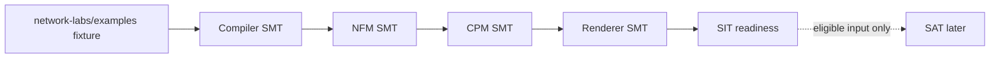

# Examples-Only SMT Traceability

This file indexes Software Module Testing evidence that is spread across the
`network-*` repositories but uses `network-labs/examples` as the fixture source.

## Scope

These rows are examples-only lower-layer evidence. They may support RaTM
construction review, SMT module evidence, or SIT readiness when the row names
the exact evidence surface. They must not
reference controlled SAT source paths under `sat/`, live runtime state, or the
full lab rebuild loop. If a script mixes examples with SAT source fixtures,
split it or do not tag it here.

SMT proves a specific construction/module contract before SAT. It does not
prove the controlled SAT runtime boundary works.

Every row has a stable `LAB-SMT-*` identifier. The referenced test script must
carry the same identifier in its header so a reviewer can trace from this index
to the exact module test without reading lab-loop context.

## Promotion Shape

## Distributed SMT Rows

| SMT ID | FIXTURE | TEST SCRIPT | MODULE | WHAT IT PROVES | WHY THIS IS VALID SMT |
| --- | --- | --- | --- | --- | --- |
| `LAB-SMT-001` | `examples/dual-wan-branch-overlay` and `examples/dual-wan-branch-overlay-bgp` | `network-compiler/tests/test-dual-wan-branch-overlay.sh` | Compiler | Overlay name, terminating node, peer site, and east-west communication relations survive compilation. | It compiles example `intent.nix` only and inspects compiler JSON/provenance, so inventory and renderers cannot hide or create the behavior. |
| `LAB-SMT-002` | `examples/overlay-east-west`, `examples/single-wan-with-nebula`, `examples/single-wan-with-nebula-any-to-any-fw` | `network-labs/tests/test-overlay-underlay-service-reachability-examples.sh` | Intent fixture review | Overlay daemon reachability is explicit as `nebula` traffic and an underlay allow relation. | It imports only example `intent.nix` files and fails before compiler/NFM/renderer stages can infer overlay underlay reachability. |
| `LAB-SMT-003` | `examples/s-router-overlay-dns-lane-policy` | `network-forwarding-model/tests/test-example-no-nat66-synthesis.sh` | NFM | NAT66 is not synthesized when the example does not explicitly model it. | It compiles the forwarding model and scans `egressIntent.nat66`; a renderer cannot be the source of truth for missing NAT66 intent. |
| `LAB-SMT-004` | `examples/s-router-overlay-dns-lane-policy` | `network-control-plane-model/tests/test-example-no-nat66-synthesis.sh` | CPM | CPM preserves the no-NAT66 contract and does not emit IPv6 NAT intent on its own. | It builds CPM from the example and checks `natIntent`; this proves the renderer contract is absent unless the model explicitly supplies it. |
| `LAB-SMT-005` | `examples/tri-site-dual-wan-overlay-integration-static` and `examples/s-router-overlay-dns-lane-policy` | `network-forwarding-model/tests/test-hostile-dns-east-west.sh` | NFM | Hostile east-west DNS lanes, public defaults, and runtime routed-prefix return routes remain explicit forwarding facts. | It inspects NFM route destinations, gateways, and `sourceFile` metadata, proving forwarding truth before CPM or renderers materialize it. |
| `LAB-SMT-006` | `examples/s-router-overlay-dns-lane-policy` | `network-control-plane-model/tests/test-delegated-overlay-public-egress.sh` | CPM | Delegated public egress over overlay has explicit policy-only defaults, return routes, and no unrelated access-node leak. | It inspects CPM `runtimeTargets.effectiveRuntimeRealization`, so renderer output can only preserve or lose these facts, not define them. |
| `LAB-SMT-007` | `examples/s-router-overlay-dns-lane-policy` | `network-control-plane-model/tests/test-sitec-dmz-dns-route-loop.sh` | CPM | Site-C DMZ DNS route contracts do not loop back through the wrong lane. | It checks CPM route contracts from the example before any Linux nft or route syntax exists. |
| `LAB-SMT-008` | `examples/tri-site-s-router-overlay-egress` | `network-forwarding-model/tests/test-overlay-core-local-hostile-return-routes.sh` | NFM | Local overlay edge return routes for hostile IPv4, hostile ULA, and runtime delegated hostile GUA use the real upstream leg. | It checks NFM route metadata on the example fixture, so the virtual overlay underlay cannot mask missing internal return routes. |
| `LAB-SMT-009` | `examples/tri-site-s-router-overlay-egress` | `network-control-plane-model/tests/test-overlay-core-local-hostile-return-routes.sh` | CPM | CPM preserves NFM hostile return routes and runtime source-file route contracts. | It checks CPM structured route output, proving renderer-neutral contract preservation before NixOS or CLAB syntax. |
| `LAB-SMT-010` | `examples/tri-site-s-router-overlay-egress` | `network-control-plane-model/tests/test-overlay-underlay-access-dynamic-client-addressing.sh` | CPM | Overlay underlay core interfaces are explicit DHCP/SLAAC tenant-client attachments. | It checks CPM `dynamicAddressing`, proving renderers do not have to infer DHCP/RA from missing static addresses or names. |
| `LAB-SMT-011` | `examples/tri-site-s-router-overlay-egress` | `network-renderer-nixos/tests/test-overlay-core-local-hostile-return-routes.sh` | NixOS renderer | The NixOS renderer projects explicit CPM hostile return routes into main/policy tables and dynamic source-file route services. | It is renderer SMT only: it proves NixOS preserves CPM data. The equivalent behavior must still have NFM/CPM rows above to be renderer-neutral. |
| `LAB-SMT-012` | `examples/ipv6-pd-downstream-delegation` | `network-labs/tests/test-ipv6-pd-downstream-delegation-example-required.sh` | Example fixture and CPM compatibility | The example carries routed prefix delegation intent and both renderer inventories compile through CPM. | It checks the example shape directly and builds CPM for both inventories, so missing PD fixture data is caught before renderer-specific tests. |
| `LAB-SMT-013` | `examples/ipv6-pd-downstream-delegation` | `network-renderer-nixos/tests/test-ipv6-pd-downstream-delegation-example-required.sh` | NixOS renderer | NixOS renders dynamic RA generation from a supplied prefix source file with explicit delegated and tenant prefix lengths. | It reads the rendered NixOS service/path configuration from the example, proving projection of explicit model data rather than live SAT behavior. |
| `LAB-SMT-014` | `examples/s-router-overlay-dns-lane-policy` | `network-renderer-nebula/tests/test-nebula-delegated-default-exit.sh` | Nebula provider renderer | Delegated overlay public egress becomes split unsafe routes via the site-C overlay peer with `install = false`, not raw installed defaults. | It renders the provider plan from example inputs and checks provider-owned route shape without deciding Linux forwarding policy. |
| `LAB-SMT-015` | `examples/s-router-overlay-dns-lane-policy` | `network-renderer-containerlab-linux-backend/tests/test-hostile-dns-east-west.sh` | CLAB renderer | Containerlab output preserves hostile east-west DNS lane routes and hostile access addresses from CPM. | It renders the example into CLAB artifacts and inspects generated node commands, so this proves renderer projection without depending on the controlled SAT source. |
| `LAB-SMT-016` | `examples/s-router-overlay-dns-lane-policy` | `network-renderer-containerlab-linux-backend/tests/test-dns-service-policy-routes.sh` | CLAB renderer | Containerlab output preserves DNS service policy routes and service-lane reachability commands. | It asserts generated CLAB backend commands from the example fixture, proving CLAB renderer behavior after CPM and before any live SAT runtime. |
| `LAB-SMT-017` | `examples/s-router-overlay-dns-lane-policy` | `network-renderer-nixos/tests/test-host-uplink-vlan-dhcp.sh` | NixOS renderer | VLAN4/VLAN5 uplinks stay DHCP/RA WAN/test attachments and host bridges stay layer-2 only. | It renders NixOS host artifacts from an example and checks VLAN/uplink behavior, proving the renderer preserves WAN/test substrate boundaries before SAT. |
| `LAB-SMT-018` | `examples/s-router-overlay-dns-lane-policy` | `network-renderer-nixos/tests/test-routed-gua-no-nat66.sh` | NixOS renderer | Routed hostile GUA is not NAT66ed while private IPv4 egress NAT remains rendered. | It inspects rendered nftables from the example, proving NixOS does not translate routed hostile public IPv6 when CPM does not ask for NAT66. |
| `LAB-SMT-019` | `examples/single-wan` | `network-renderer-nixos/tests/test-core-ipv6-nat-rendering.sh` | NixOS renderer | Explicit NAT66 source prefixes render as source-scoped nftables masquerade rules. | It validates rendered NixOS NAT rules and a source-scoped rendering helper, proving renderer projection of explicit NAT66 contract data. |
| `LAB-SMT-020` | `examples/single-wan` | `network-renderer-containerlab-linux-backend/tests/test-core-nat-wan.sh` | CLAB renderer | CLAB resolves the modeled WAN port and renders NAT44/NAT66 on that port. | It builds CPM from the example and checks generated CLAB node commands, proving renderer preservation of explicit NAT egress contracts. |
| `LAB-SMT-021` | `examples/single-wan`, `examples/single-wan-bgp`, `examples/single-wan-uplink-ebgp`, `examples/single-wan-uplink-static-egress`, `examples/single-wan-with-nebula`, and `examples/single-wan-any-to-any-fw` | `network-labs/tests/test-clab-nat-uplink-examples.sh` | Example fixture review | CLAB NAT uplink examples carry explicit NAT-mode realization fields. | It reads only example inventories, so missing NAT uplink realization is caught before compiler/NFM/CPM/renderers can compensate. |
| `LAB-SMT-022` | `examples/tri-site-dual-wan-overlay-integration-static` and `examples/tri-site-dual-wan-overlay-integration-bgp` | `network-labs/tests/test-tri-site-bgp-overlay-realization.sh` | Example fixture review | Static and BGP tri-site overlay fixtures carry concrete overlay node `/32` and `/128` realization for both CLAB and NixOS inventories. | It imports both renderer inventories directly and checks concrete overlay address shape before renderers can infer it. |
| `LAB-SMT-023` | `examples/single-wan-uplink-ebgp` | `network-renderer-nixos/tests/test-bgp-rendering.sh` | NixOS renderer | NixOS renders selected BGP routing mode, eBGP/iBGP neighbors, route-reflector clients, and tenant networks from CPM. | It renders NixOS containers from the example and checks FRR output, proving routing-mode projection without a live lab. |
| `LAB-SMT-024` | `examples/single-wan-uplink-ebgp` | `network-renderer-containerlab-linux-backend/tests/test-bgp-example.sh` | CLAB renderer | CLAB renders selected BGP routing mode, eBGP/iBGP neighbors, route-reflector clients, and tenant networks from CPM. | It builds CPM and CLAB artifacts from the example and checks generated topology output. |
| `LAB-SMT-025` | `examples/single-wan` | `network-renderer-containerlab-linux-backend/tests/test-routing-mode-required.sh` | CLAB renderer | CLAB fails when CPM runtime targets omit required `routingMode`. | It mutates example-derived CPM output by deleting `routingMode` and expects renderer failure, proving CLAB does not choose static/BGP locally. |
| `LAB-SMT-026` | `examples/*/intent.nix` | `network-labs/tests/test-example-explicit-return-behavior.sh` | Intent fixture review | Every allow relation declares a recognized return-flow decision, with matching top-level and public-ingress authority when both are present. | It imports only example intent and fails before compiler, NFM, CPM, or renderers can default or invent return semantics. |

## URS Coverage Audit

This audit is the current examples-only SMT view against the GAMP URS chain.
Rows marked as gaps are not allowed to be hidden inside SAT.

| URS AREA | EXAMPLES SMT COVERAGE | CURRENT NON-EXAMPLES MODULE COVERAGE | GAP / NEXT TEST |
| --- | --- | --- | --- |
| `/128` and VLAN4/VLAN5 WAN-only upstreams | `LAB-SMT-017` covers NixOS VLAN4/VLAN5 host-uplink rendering. | SAT/HAT runtime checks still own live `/128` and WAN `/64` behavior. | Add controlled HAT/fake-provider evidence for VLAN4/VLAN5 `/64` and `/128` upstream behavior before calling SAT eligible. |
| PPPoE `/48` routed aggregate | No examples-only SMT row exists. | `network-control-plane-model/tests/test-passing-fixtures.sh` contains a `minimal-forwarding-model-pppoe` fixture; `network-codex-agent/GAMP/SMT/SMT-PPPOE-001.nix` defines a controlled fake-provider VM using an isolated Ethernet PPPoE handoff, TEST-NET IPv4 such as `203.0.113.0/24`, and `2001:db8::/32`. | Add a `network-labs/examples` fixture or integrated module fixture for PPPoE-like `/48` routed aggregate behavior; prove explicit child `/64` routing, no intermediate router GUA, ULA NAT66 only where selected, and routed GUA no-NAT66. |
| Deterministic PD and unusual prefix lengths | `LAB-SMT-012` and `LAB-SMT-013` cover `delegatedPrefixLength = 48`, routed-prefix `perTenantPrefixLength = 52`, site PD `/48 -> /64`, and NixOS rendering. | Compiler, NFM, and CPM have additional internal module tests for `/56 -> /64`, runtime GUA return routes, and no validation shortcut. | Add CLAB renderer projection coverage for the PD downstream-delegation example. |
| Explicit ULA+NAT66 | `LAB-SMT-019`, `LAB-SMT-020`, and `LAB-SMT-021` cover renderer and fixture-side NAT66 projection. | CLAB also has synthetic CPM NAT66 coverage in `test-tri-site-core-egress-nat.sh`. | Add or identify a model-layer positive NAT66 examples SMT row so renderer NAT66 proof is backed by compiler/NFM/CPM contract proof. |
| Routed GUA without NAT66 | `LAB-SMT-003`, `LAB-SMT-004`, `LAB-SMT-018`, and hostile return-route rows cover no-synthesis and renderer no-NAT66 behavior. | Compiler/NFM/CPM internal runtime routed-prefix tests cover source-file routed GUA metadata and return routes. | Keep SAT blocked until live routed-GUA/no-NAT66 counters pass from endpoint contexts. |
| Hostile overlay egress and DNS lanes | `LAB-SMT-005` through `LAB-SMT-011`, `LAB-SMT-014`, `LAB-SMT-015`, and `LAB-SMT-016` cover model, provider, NixOS, and CLAB pieces. | Additional CPM/NixOS tests cover service exceptions, DNS direct-egress denial, and overlay route retention. | SAT remains the required live proof for overlay online state, traceroute, DNS leak denial, and nft counters. |
| Static/BGP routing style | `LAB-SMT-001`, `LAB-SMT-022`, `LAB-SMT-023`, `LAB-SMT-024`, and `LAB-SMT-025` cover example shape and renderer projection/failure. | Renderer and CPM suites contain additional routing-mode and static-uplink checks. | Add model-layer mixed static/BGP examples SMT if the current tri-site fixture only validates inventory shape and renderer output. |

## Maintenance Rule

When a SAT failure is reduced to a module hypothesis, add or update the row for
the `examples/` fixture that reproduces the contract. Do not add a row that
depends on live lab state or a mutable SAT source path.
